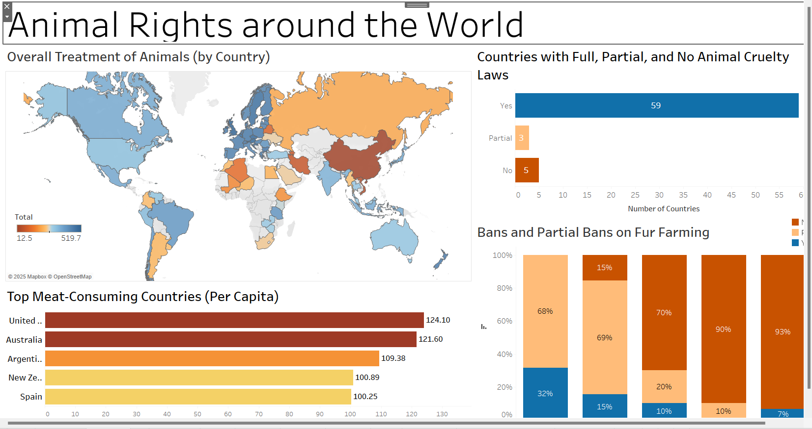
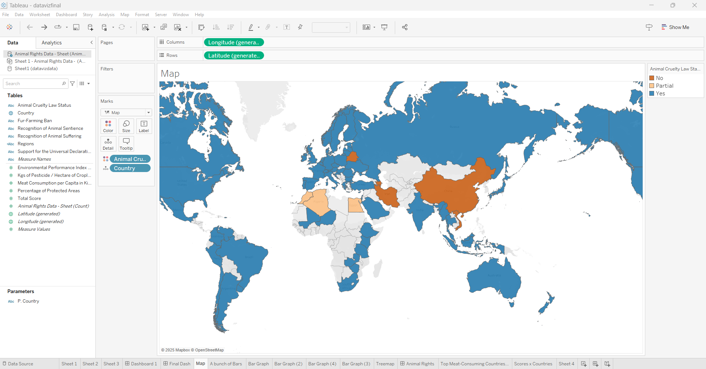
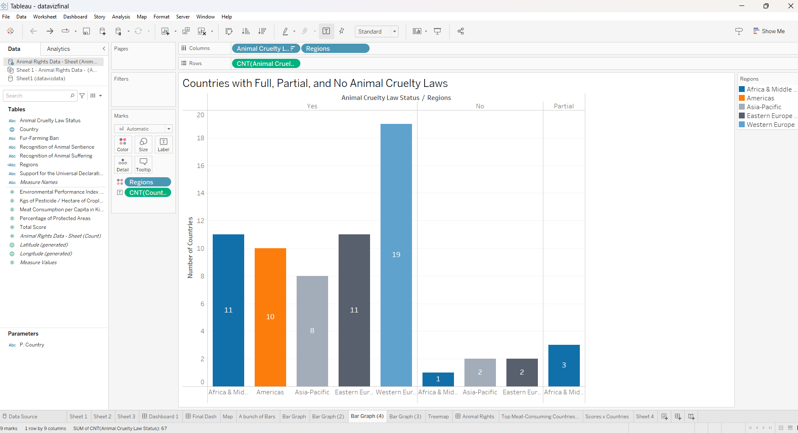

Data Visualization - Animal Rights Data
Better Visuals, Better Voices for Animals
Understanding Global Animal Welfare and Ethical Practices

Our Dashboard

Project Overview
This project aims to improve data visualization for animal rights and welfare by analyzing global trends in:

Meat consumption and its impact:
1. Fur trade practices
2. Animal cruelty policies
3. Regional animal welfare trends
4. Data Sources
We collected data from:

PETA (People for the Ethical Treatment of Animals)
World Animal Protection
Global Animal Law
Animal Rights Index
Tools & Technologies
Power BI / Tableau – for dashboard creation
Excel / SQL – for data preprocessing
Python (Pandas, Matplotlib, Seaborn) – for data analysis
PowerPoint – for final presentation

 Key Insights:
1 Some regions have weak policies on animal welfare.
2. High fur farming countries need awareness campaigns.
3 Educating consumers can influence ethical decisions.

Files in This Repository:
File Name	Description
Data Visualization - Animal Rights Data.pptx	PowerPoint presentation with visualized insights
dataset.csv	Raw data used for analysis
dashboard.pbix	Power BI visualization file

Team Members
Brendon Matsikinya
Tony Afuti
Luke Henkel
Vanessa Hernandez
📩 Contact & Contribution
📧 Have questions or suggestions? Feel free to reach out!
🔗 LinkedIn: https://www.linkedin.com/in/brendon-t-matsikinya/
📍 Contributions are welcome! Fork the repo and submit a pull request.
